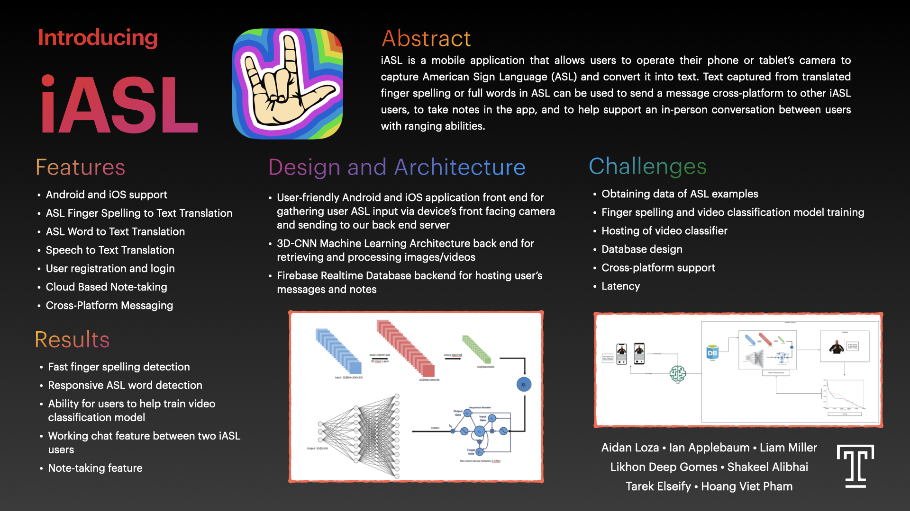

# iASL-Backend

This repository is intended to contain the back-end material for the iASL application. Specifically, it will contain the machine learning model for the neural network used in this application.

The main code for running the training portion of the model can be found in the `scripts` folder. The main script, `train.sh`, runs the training network and saves the model to the folder `output/p1_train`. The training process results in three files being saved, as well as one additional weights file for every epoch.

The ASL finger dataset used is located here: 
https://www.kaggle.com/grassknoted/asl-alphabet

## Training

Included in the data_processing directory is a `collect_data.py` file. This contains a class responsible for batch data generation. This class takes in class mapping which is a dictionary where the key is the label and the value is the integer index value. This file creates a master mapping of each image file and its label, and allows for parallel batch processing during training. This data generator is necessary for the training script. To train a model on a dataset, a file list with a new line seperated list of file names should be provided. Along with this, the corresponding ref file should be provided which contains the label in the same order as the image. Use the `gen_labels.py` script to generate this after the file list has been created. Some hyper parameter values can be found in the parameter file in `params/params_train.txt`. Each epoch, the model will output to `output/p1_train` a weights file. To run the training script, simply edit the parameter file as necessary and run `train.sh`. This will source the `_runtime_env.sh` which contains environment variables necessary for the script to run. Note that `train.py` will fail to run if the runtime file is not sourced.

## Realtime Detection

The `realtime-detection.py` script only takes a parameter file. In this file should be a model directory (relative to the iASL_OUT directory) where the model and weights are stored. This script will load these files to use as the model. On start-up, there will be a green box in the top left of the screen. Place your hand there within the first three seconds. This will activate the object tracking so the region of interest will follow your hand. Each frame displayed will be sent to the model for classsification. On detection, the confidence and label will be displayed in a black box. Running `detect.sh` will provide the parameter file and source the runtime file, so it is suggested to run the bash file as opposed to running the python script directly.

## Video Classification Model

In the `containerized` directory, there is an environment for deploying a video classifier. This directory includes a Dockerfile that allows for building a Docker image that can be deployed. 

Example:
`docker build -t tf-server .`
`docker run -d -p 8080 tf-server`

This is possible through the use of Flask in the `app.py` script. It exposes port 8080 and takes in requests through the `/predict`route. This POST method takes in an argument `vid_stuff` which takes in a Base64 encoded string of 40 50x50x3 images. The shape must exactly match a flattened 40x50x50x3 array. These inputs are resized back up to 40x150x150x3. In the `mdl_dir` directory, there exists a JSON file containing the model architecture and an hdf5 file with the latest weights. One can load this model up to train on their own data. The input to the model is a sequence of 40x150x150x3. This uses the Inception3D model, which uses 3D-Convolutional neural networks. Currently, the top layer of this model has 55 output nodes, due to only 55 words that were trained on. To increase the number of output nodes, a new Inception3D model must be instantiated and a new top layer must be put in place.
